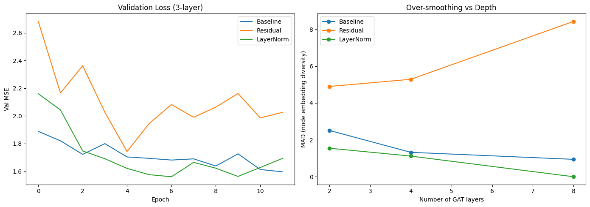

# GAT Over-smoothing Explorer

This is a project I built to look at a specific problem in graph neural networks: over-smoothing. If you've spent time with GNNs, you know that unlike standard CNNs, stacking more layers usually makes the model worse, not better. 

This repo has a small Gradio app where you can type in a molecule (as a SMILES string) and watch over-smoothing happen in real-time. It builds a molecular graph, runs it through three different Graph Attention Network (GAT) setups up to 16 layers deep, and plots the node diversity at each step.

## The Problem: Over-smoothing

In a GNN, every layer passes messages between connected nodes (atoms). If you do this too many times, the embeddings for all the nodes start to converge and look exactly the same. For molecules, this means the network forgets how to tell a carbon atom from an oxygen atom. That's over-smoothing.

To test this, I built three specific model variations:
1. **Baseline**: A plain stacked GAT with BatchNorm. No mitigation.
2. **Residual**: The same setup, but with skip connections added to preserve earlier information.
3. **LayerNorm**: Swapping out BatchNorm for LayerNorm to normalize across features instead of the batch.

## Results

I trained all three models on the QM9 dataset using Kaggle. The chart below shows what happened. 

On the left is the validation loss during training. On the right is the Mean Average Distance (MAD) of the node embeddings as the networks get deeper. MAD just measures how far apart the embeddings are. When MAD drops toward zero, the embeddings have collapsed.

As you can see, the baseline model's embeddings totally collapse as it gets deeper. The Residual and LayerNorm fixes hold up much better.



## What's in this repo

- `app.py`: The Gradio web interface. This is what you run to launch the local website.
- `models.py`: The PyTorch implementations of the three GAT architectures.
- `featurize.py`: Turns a SMILES string into the graph tensors (node features and edge indices) the models expect. It uses RDKit to build the molecule on the fly.
- `metrics.py`: The math for calculating Mean Average Distance (MAD).
- `requirements.txt`: The Python dependencies.
- `checkpoints/`: Contains the trained `.pt` weight files generated from the Kaggle training run. If the app sees these files, it uses them instead of random weights.

## Running it locally

To run this on your machine, you need Python 3.8 or newer. Do yourself a favor and use a virtual environment, because installing PyTorch and RDKit in your global environment can get messy.

1. Clone or download this repository to your computer.
2. Open your terminal and navigate to the project folder.
3. Activate your virtual environment.
4. Install the dependencies by running this exact command:

```bash
pip install -r requirements.txt
```
*Specific note on PyTorch Geometric: Depending on your OS and whether you have a GPU, `torch_geometric` can sometimes be annoying to install via the standard requirements file. If the pip install fails, check the [PyG installation guide](https://pytorch-geometric.readthedocs.io/en/latest/install/installation.html) and install the wheels manually.*

5. Launch the app by running:
```bash
python app.py
```

6. Open your browser and go to `http://127.0.0.1:7860`.

## Using the app
When the app loads, it will already have caffeine's SMILES string typed in as a starting point. 

1. Hit the **"Run over-smoothing analysis"** button.
2. Within a few seconds, it will generate a plot showing the MAD at depths 2 through 16 for all three models. It will also print a markdown table of the exact numbers below the plot.
3. You can change the "Maximum depth" slider if you want to test shallower networks (e.g., max depth 8).
4. You can type in your own molecules. Just remember that QM9 only covers H, C, N, O, and F atoms, so the app will throw an error if you try to use something like Chlorine. Molecules are also capped at 60 atoms so the calculations stay fast.

## A specific note on the atom features
The way I turn SMILES into atom features in `featurize.py` is modeled on QM9's standard setup (one-hot atom type, atomic number, aromaticity, hybridization, hydrogen count). 

It is not byte-identical to PyTorch Geometric's built-in QM9 loader. PyG pulls its features from precomputed dataset files. This app builds them on the fly using RDKit. It captures the exact same chemical information, just through a different pipeline. It's more than accurate enough for a demonstration, but I wanted to be upfront about that in case you compare the raw numbers.
```
